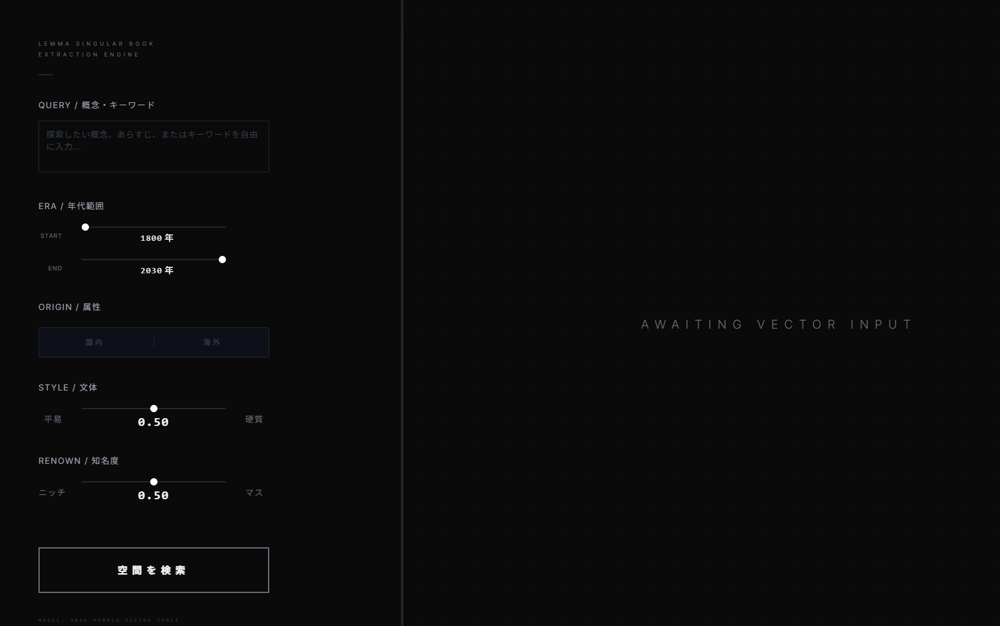
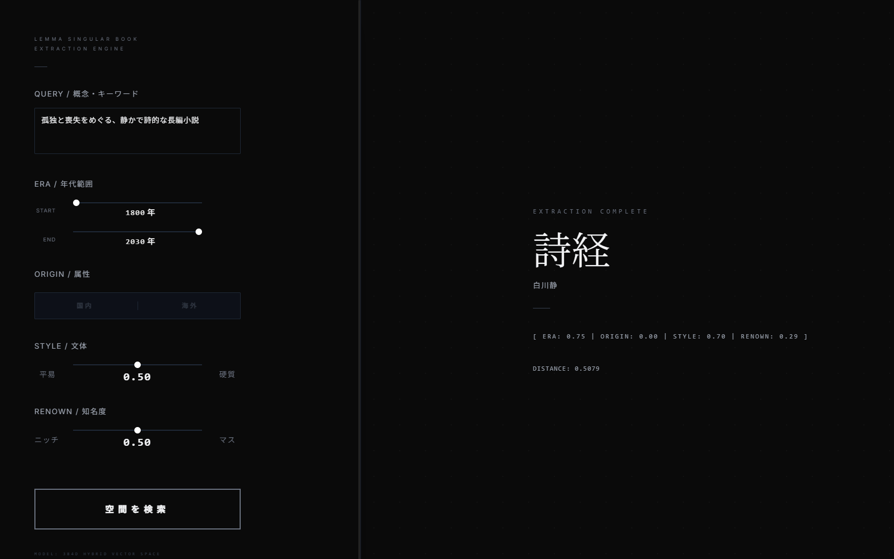
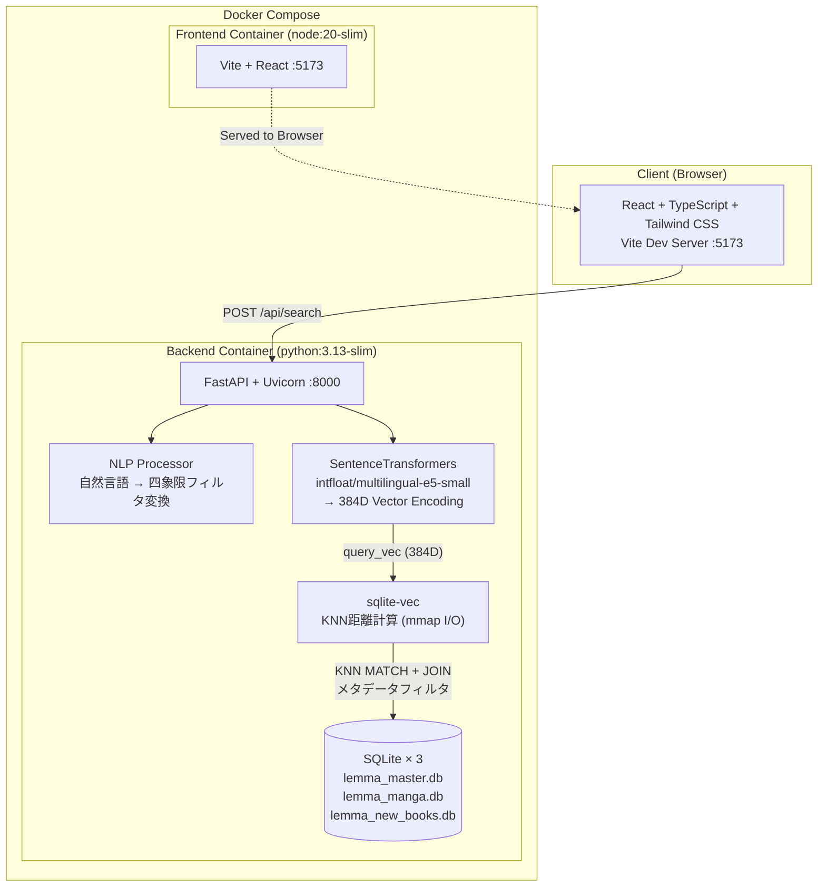

# Lemma — 384D Hybrid Vector Book Extraction Engine

**120万件の書籍データから、SentenceTransformers (`e5-small`) による384次元ベクトル空間と、四象限メタデータフィルタを組み合わせた完全自律・ステートレス型ハイブリッド検索エンジン。**

ユーザーは単一のテキストポート（Zero-Routing UI）に自然言語やキーワードを投げ込むだけで、最適な一冊を抽出できる。

## デモ

| 入力（Zero-Routing UI） | 抽出結果（EXTRACTION COMPLETE） |
|---|---|
|  |  |

> 例: 「孤独と喪失をめぐる、静かで詩的な長編小説」という自然言語クエリを 384 次元ベクトルへ変換し、120 万件の空間から最近傍の一冊（`distance: 0.5079`）を抽出。四象限ベクトル `[ERA, ORIGIN, STYLE, RENOWN]` も同時に返却する。

---

## 解決する課題

従来の書籍検索はキーワードの完全一致や、出版社が定義したカテゴリに依存している。  
Lemma は書籍のタイトル・著者・説明文を **384次元の密ベクトル** としてエンコードし、`sqlite-vec` によるベクトル距離計算と四象限メタデータフィルタ `[ERA, ORIGIN, STYLE, RENOWN]` を併用することで、「なんとなくこういう本が読みたい」という曖昧な要求に対して数学的に最適な一冊を返す。

---

## システム構成



---

## 技術スタック

| レイヤー | 技術 | 用途 |
|:---|:---|:---|
| **言語** | Python 3.13 / TypeScript 5.x | バックエンド / フロントエンド |
| **API** | FastAPI + Uvicorn | 非同期APIサーバー、自動OpenAPIドキュメント生成 |
| **データバリデーション** | Pydantic v2 | リクエスト/レスポンスの型安全な検証 |
| **NLPプロセッサ** | SentenceTransformers (`intfloat/multilingual-e5-small`) | クエリテキストの384次元密ベクトルエンコード |
| **ベクトル演算** | sqlite-vec (SQLite C extension) | インメモリ展開を排除したステートレスな全件走査 |
| **データストア** | SQLite × 3 (ATTACH + UNION ALL) | 複数DBの仮想統合による単一クエリ空間 |
| **フロントエンド** | React 18 + Vite + Tailwind CSS | SPA、Zero-Routing UI |
| **パッケージ管理** | uv (Astral) | Rust製超高速パッケージマネージャー |
| **静的解析** | Ruff | Rust製超高速リンター/フォーマッター |
| **コンテナ** | Docker + Docker Compose | ワンコマンドでのインフラ再現 |

---

## クイックスタート

### 前提条件

- [Docker](https://docs.docker.com/get-docker/) & Docker Compose
- SQLite データベースファイル群を `backend/` 配下に配置

### 起動

```bash
# リポジトリをクローン
git clone https://github.com/aksunknk/Lemma.git
cd Lemma

# ワンコマンドでビルド & 起動
docker compose up --build
```

起動後、以下のURLにアクセスできる:

| サービス | URL |
|:---|:---|
| フロントエンド (UI) | http://localhost:5173 |
| バックエンド API | http://localhost:8000 |
| Swagger UI (API仕様書) | http://localhost:8000/docs |
| OpenAPI JSON | http://localhost:8000/openapi.json |

---

## API 仕様

### `POST /api/search`

384次元ベクトル空間上のKNN探索と四象限メタデータフィルタを併用し、最近傍の書籍を返却する。  
ペイロードは完全委譲型（Zero-Routing）であり、`query` に自然言語を投入するだけで検索が完結する。`keyword` は省略可能。

**リクエストボディ:**

```json
{
  "query": "哲学的なSF漫画、少し古め",
  "era_min": null,
  "era_max": null,
  "origin": null,
  "style": null,
  "renown": null,
  "keyword": null
}
```

**レスポンス (200 OK):**

```json
{
  "status": 200,
  "item_id": "9784003364017",
  "title": "ソラリス",
  "author": "スタニスワフ・レム",
  "source": "早川書房",
  "category": "book",
  "distance": 0.1247,
  "vector": [0.35, 1.0, 0.9, 0.8]
}
```

> `vector` は四象限メタデータ `[ERA, ORIGIN, STYLE, RENOWN]` の4値。384次元の密ベクトルはレスポンスに含まない。

---

## 四象限メタデータフィルタの定義

各書籍は以下の4軸で `[0.0, 1.0]` の連続値にマッピングされている。  
これらはベクトル検索の結果に対する事後フィルタとして機能し、384次元の意味空間とは独立した軸である。

| 軸 | 名称 | 0.0 | 1.0 |
|:---|:---|:---|:---|
| `era` | 年代 | 古典 (明治以前) | 最新刊 (2020年代) |
| `origin` | 出自 | 国内作品 | 海外・翻訳作品 |
| `style` | 文体 | 平易・ライト | 硬質・学術的 |
| `renown` | 知名度 | マイナー・隠れた名作 | ベストセラー・定番 |

---

## インフラにおける設計判断

### メモリ死重の排除（Stateless I/O）

旧アーキテクチャでは Pandas DataFrame に120万件の書籍データをインメモリ展開し、NumPy によるベクトル演算を行っていた。これは $O(N)$ の空間計算量をプロセスに恒常的に課すことを意味する。

現行アーキテクチャでは、`sqlite-vec` の mmap I/O を用いてデータをディスク上に据え置いたまま KNN 探索を実行する。SentenceTransformers モデル（約100MB）のみがメモリに常駐し、書籍データ自体はリクエストごとに軽量な SQLite 接続を生成して走査する完全ステートレス設計となっている。

**検証結果:**  
120万件に対する1000件連続の四象限ストレステストにおいて、メモリリーク0%、平均レイテンシ約3.49秒の安定稼働を確認。データを RAM に常駐させる $O(N)$ の空間計算量をパージし、極限の I/O 効率を実現した。

### uv によるビルド時間の極小化

従来の `pip install` を `uv sync --frozen` に置換することで、依存解決とインストールを **数秒** で完了させている。  
Dockerfile では Astral 公式イメージから `uv` バイナリを直接コピー（マルチステージ不要）し、`pyproject.toml` + `uv.lock` のレイヤーキャッシュを最大限に活用している。

```dockerfile
COPY --from=ghcr.io/astral-sh/uv:latest /uv /uvx /bin/
COPY pyproject.toml uv.lock ./
RUN uv sync --frozen --no-install-project --no-dev
```

### ボリュームマウント耐性

開発時に `docker compose` でホストディレクトリをマウントすると、コンテナ内の `.venv` がホスト（Windows）側のバイナリで上書きされる問題を回避するため、仮想環境をソースツリー外（`/opt/venv`）に隔離している。

```dockerfile
ENV UV_PROJECT_ENVIRONMENT="/opt/venv"
ENV PATH="/opt/venv/bin:$PATH"
```

### FastAPI の自己文書化

FastAPI の OpenAPI 自動生成機能により、コードを書くだけで常に最新の API 仕様書（Swagger UI）が `/docs` に自動公開される。Pydantic v2 によるリクエスト/レスポンスモデルの型定義が、そのままスキーマドキュメントとなる。

### SQLite の仮想統合空間

外部DBサーバーへの依存を排除し、複数の SQLite ファイルを `ATTACH DATABASE` + `UNION ALL` で単一のクエリ空間として結合している。これにより、ゼロ構成でポータブルな120万件のデータストアを実現している。

---

## プロジェクト構成

```
lemma_project_core/
├── docker-compose.yml          # オーケストレーション定義
├── README.md
│
├── backend/
│   ├── Dockerfile              # uv 最適化コンテナ
│   ├── pyproject.toml          # 依存定義 (uv)
│   ├── uv.lock                 # 決定論的ロックファイル
│   ├── main.py                 # FastAPI エントリポイント
│   ├── vector_search.py        # 384D ハイブリッド検索エンジン (sqlite-vec)
│   ├── nlp_processor.py        # 自然言語 → 四象限フィルタ変換
│   ├── models.py               # データモデル定義
│   ├── database.py             # DB接続管理
│   ├── lemma_master.db         # メインDB (~120万件)
│   ├── lemma_manga.db          # マンガDB
│   └── lemma_new_books.db      # 新刊DB (2024-2026)
│
└── frontend/
    ├── Dockerfile
    ├── package.json
    ├── tsconfig.json
    ├── tailwind.config.js
    └── src/
        └── ...                 # React コンポーネント群
```

---

## ライセンス

This project is for portfolio and educational purposes.
