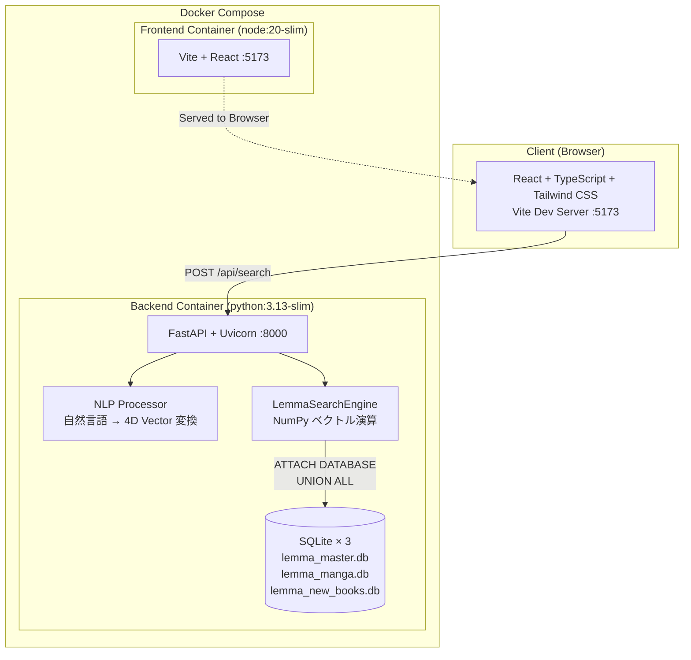

# Lemma — 4D Vector Book Search Engine

**120万件の書籍データから、4次元ベクトル空間上の最近傍探索によって "一冊" を導き出す検索エンジン。**

ユーザーが「年代」「国内/海外」「文体の硬軟」「知名度」の4軸をスライダーで操作するか、自然言語で問いかけるだけで、膨大な書籍空間の中から最も近い一冊を抽出します。

---

## 解決する課題

従来の書籍検索はキーワードの完全一致や、出版社が定義したカテゴリに依存しています。  
Lemma は書籍の属性を **4次元の連続値ベクトル** `[ERA, ORIGIN, STYLE, RENOWN]` として定量化し、ユークリッド距離による最近傍探索を行うことで、「なんとなくこういう本が読みたい」という曖昧な要求に対して数学的に最適な一冊を返します。

---

## システム構成



---

## 技術スタック

| レイヤー | 技術 | 用途 |
|:---|:---|:---|
| **言語** | Python 3.13 / TypeScript 5.x | バックエンド / フロントエンド |
| **API** | FastAPI + Uvicorn | 非同期APIサーバー、自動OpenAPIドキュメント生成 |
| **データバリデーション** | Pydantic v2 | リクエスト/レスポンスの型安全な検証 |
| **ベクトル演算** | NumPy + Pandas | 120万件のインメモリベクトル空間探索 |
| **データストア** | SQLite × 3 (ATTACH + UNION ALL) | 複数DBの仮想統合による単一クエリ空間 |
| **フロントエンド** | React 18 + Vite + Tailwind CSS | SPA、4軸スライダーUI |
| **パッケージ管理** | uv (Astral) | Rust製超高速パッケージマネージャー |
| **静的解析** | Ruff | Rust製超高速リンター/フォーマッター |
| **コンテナ** | Docker + Docker Compose | ワンコマンドでのインフラ再現 |

---

## クイックスタート

### 前提条件

- [Docker](https://docs.docker.com/get-docker/) & Docker Compose
- SQLite データベースファイル群を `backend/` 配下に配置

### 起動

```bash
# リポジトリをクローン
git clone https://github.com/aksunknk/Lemma.git
cd Lemma

# ワンコマンドでビルド & 起動
docker compose up --build
```

起動後、以下のURLにアクセスできます:

| サービス | URL |
|:---|:---|
| フロントエンド (UI) | http://localhost:5173 |
| バックエンド API | http://localhost:8000 |
| Swagger UI (API仕様書) | http://localhost:8000/docs |
| OpenAPI JSON | http://localhost:8000/openapi.json |

---

## API 仕様

### `POST /api/search`

4次元ベクトルまたは自然言語クエリを受け取り、最近傍の書籍を返却します。

**リクエストボディ:**

```json
{
  "query": "哲学的なSF漫画、少し古め",
  "era_min": 0.0,
  "era_max": 1.0,
  "origin": 0.5,
  "style": 0.5,
  "renown": 0.5,
  "keyword": null
}
```

**レスポンス (200 OK):**

```json
{
  "status": 200,
  "item_id": "9784003364017",
  "title": "ソラリス",
  "author": "スタニスワフ・レム",
  "source": "早川書房",
  "category": "book",
  "distance": 0.1247,
  "vector": [0.35, 1.0, 0.9, 0.8]
}
```

---

## 4次元ベクトル空間の定義

各書籍は以下の4軸で `[0.0, 1.0]` の連続値にマッピングされています。

| 軸 | 名称 | 0.0 | 1.0 |
|:---|:---|:---|:---|
| `era` | 年代 | 古典 (明治以前) | 最新刊 (2020年代) |
| `origin` | 出自 | 国内作品 | 海外・翻訳作品 |
| `style` | 文体 | 平易・ライト | 硬質・学術的 |
| `renown` | 知名度 | マイナー・隠れた名作 | ベストセラー・定番 |

---

## インフラにおける設計判断

### uv によるビルド時間の極小化

従来の `pip install` を `uv sync --frozen` に置換することで、依存解決とインストールを **数秒** で完了させています。  
Dockerfile では Astral 公式イメージから `uv` バイナリを直接コピー（マルチステージ不要）し、`pyproject.toml` + `uv.lock` のレイヤーキャッシュを最大限に活用しています。

```dockerfile
COPY --from=ghcr.io/astral-sh/uv:latest /uv /uvx /bin/
COPY pyproject.toml uv.lock ./
RUN uv sync --frozen --no-install-project --no-dev
```

### ボリュームマウント耐性

開発時に `docker compose` でホストディレクトリをマウントすると、コンテナ内の `.venv` がホスト（Windows）側のバイナリで上書きされる問題を回避するため、仮想環境をソースツリー外（`/opt/venv`）に隔離しています。

```dockerfile
ENV UV_PROJECT_ENVIRONMENT="/opt/venv"
ENV PATH="/opt/venv/bin:$PATH"
```

### FastAPI の自己文書化

FastAPI の OpenAPI 自動生成機能により、コードを書くだけで常に最新の API 仕様書（Swagger UI）が `/docs` に自動公開されます。Pydantic v2 によるリクエスト/レスポンスモデルの型定義が、そのままスキーマドキュメントとなります。

### SQLite の仮想統合空間

外部DBサーバーへの依存を排除し、複数の SQLite ファイルを `ATTACH DATABASE` + `UNION ALL` で単一のクエリ空間として結合しています。これにより、ゼロ構成でポータブルな120万件のデータストアを実現しています。

---

## プロジェクト構成

```
lemma_project_core/
├── docker-compose.yml          # オーケストレーション定義
├── README.md
│
├── backend/
│   ├── Dockerfile              # uv 最適化コンテナ
│   ├── pyproject.toml          # 依存定義 (uv)
│   ├── uv.lock                 # 決定論的ロックファイル
│   ├── main.py                 # FastAPI エントリポイント
│   ├── vector_search.py        # 4D ベクトル検索エンジン
│   ├── nlp_processor.py        # 自然言語 → ベクトル変換
│   ├── models.py               # データモデル定義
│   ├── database.py             # DB接続管理
│   ├── lemma_master.db         # メインDB (~120万件)
│   ├── lemma_manga.db          # マンガDB
│   └── lemma_new_books.db      # 新刊DB (2024-2026)
│
└── frontend/
    ├── Dockerfile
    ├── package.json
    ├── tsconfig.json
    ├── tailwind.config.js
    └── src/
        └── ...                 # React コンポーネント群
```

---

## ライセンス

This project is for portfolio and educational purposes.
